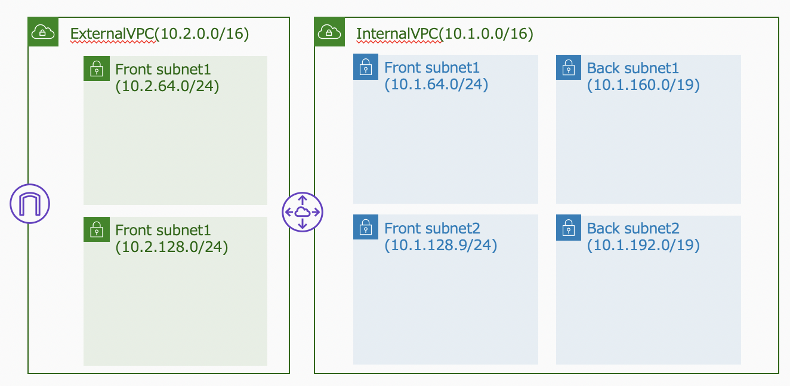

# CfnCreatingVPC
VPC環境作成用の、CloudFormation テンプレート

# 単一VPC作成のCloudFormationテンプレート
テンプレートは以下の３種類あります。
- 2subnets in a VPC
- 4subnets in a VPC
- 6subnets in a VPC

4サブネット(IGWあり、NATGatewayなしパターンのスタック作成例)
```shell
CFN_STACK_PARAMETERS='
[
  {
    "ParameterKey": "DnsHostnames",
    "ParameterValue": "true"
  },
  {
    "ParameterKey": "DnsSupport",
    "ParameterValue": "true"
  },
  {
    "ParameterKey": "InternetAccess",
    "ParameterValue": "true"
  },
  {
    "ParameterKey": "EnableNatGW",
    "ParameterValue": "false"
  },
  {
    "ParameterKey": "VpcName",
    "ParameterValue": "TestVPC"
  },
  {
    "ParameterKey": "VpcInternalDnsName",
    "ParameterValue": "test.local."
  }
]'

aws --profile ${PROFILE} cloudformation create-stack \
    --stack-name SGWPoC-VPC \
    --template-body "file://./vpc-4subnets.yaml" \
    --parameters "${CFN_STACK_PARAMETERS}" \
    --capabilities CAPABILITY_IAM ;
```

# 複合型VPC作成のCloudFormationテンプレート

```shell
aws --profile ${PROFILE} cloudformation create-stack \
    --stack-name FSx-VPC \
    --template-body "file://./2VPCEnvironment/2vpc_2subnet-4subnets.yaml" \
    --capabilities CAPABILITY_IAM ;
```
